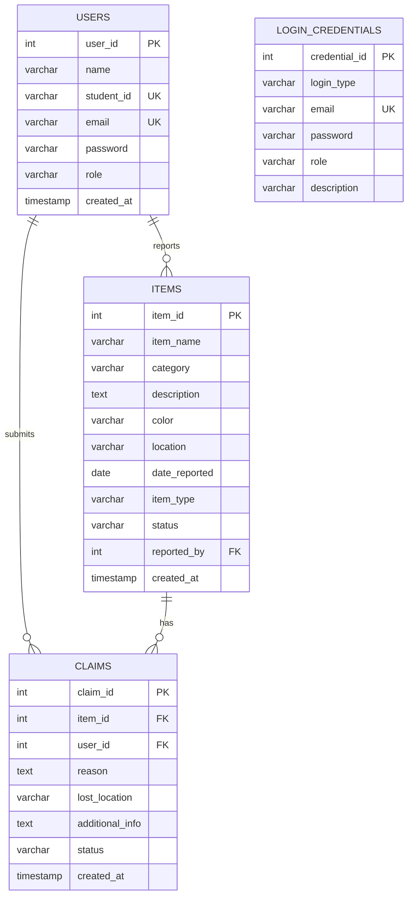

# CBSE Class 12 Computer Science (Sub Code: 083) Project Report
# Digital Belongings Portal — School Lost & Found Management System

💻 **Local Host Application:** `http://127.0.0.1:5000` | **Database:** MySQL 8.0

---

## 1. Project Overview & Abstract

### 1.1 Objective
The **School Lost & Found Management System (Digital Belongings Portal)** is a full-stack, secure web application designed to solve a ubiquitous problem in educational institutions: the loss, recovery, and verification of personal student belongings (such as scientific calculators, ID cards, notebooks, water bottles, and electronics).

Traditionally, lost-and-found items in schools are maintained either on paper registers or physically stacked in administrative offices, leading to low recovery rates, lack of student privacy, and administrative burden. This portal automates the entire lifecycle:
1. **Reporting:** Students can catalog lost or found items with categorical tags, locations, dates, and descriptions.
2. **Automated Matching Engine:** A heuristic weighted matching algorithm calculates cross-similarity scores between lost and found items in real-time.
3. **Claim & Verification Protocol:** Owners can submit verifiable claims with proprietary proof (e.g., unique scratches, serial codes, contents).
4. **Administrative Moderation:** School authorities oversee and approve reports, verify claims, prevent bogus submissions, and log item handover.

### 1.2 Curriculum Alignment (CBSE Class 12 CS - 083)
This project strictly satisfies and exceeds the CBSE Class 12 Computer Science curriculum requirements:
- **Python Programming:** Functions, modules, dictionary manipulation, string tokenization, exception handling (`try-except-finally`), and decorators.
- **Database Management (MySQL):** Relational tables, Primary Keys, Foreign Keys with `ON DELETE CASCADE`, constraints (`UNIQUE`, `NOT NULL`, `DEFAULT`).
- **SQL Operations:** DDL (`CREATE`, `DROP`), DML (`INSERT`, `UPDATE`, `DELETE`), DQL (`SELECT`, `WHERE`, `LIKE`, `ORDER BY`), SQL Aggregations (`COUNT()`, `GROUP BY`), and Relational `INNER JOIN` operations.
- **Python-SQL Connectivity:** Implemented via `mysql.connector` with connection pooling, cursor handling, parameterized queries (preventing SQL Injection), and transaction management (`commit()` and `rollback()`).

---

## 2. System Architecture & Tech Stack

```
+-------------------------------------------------------------------+
|                        Client Browser                             |
|       (Responsive UI: HTML5, Modern CSS Glassmorphism, JS)        |
+---------------------------------+---------------------------------+
                                  | HTTP / HTTPS Requests
                                  v
+-------------------------------------------------------------------+
|                     Python Flask Application                      |
|  - Route Dispatcher & Controller (app.py)                         |
|  - Security & RBAC Decorators (@login_required, @admin_required)  |
|  - Werkzeug Password Hashing (scrypt algorithm)                   |
|  - Weighted Heuristic Recommendation Engine                       |
|  - Centralized Query Handler (execute_query)                      |
+---------------------------------+---------------------------------+
                                  |
                                  v
+-------------------------------------------------------------------+
|                     Database Connectivity Layer                   |
|  - MySQL Connection Pool (mysql.connector.pooling)                |
|  - Parameterized Sanitized SQL Queries (%s placeholder)           |
|  - Local/Cloud SQLite Fallback Layer                              |
+---------------------------------+---------------------------------+
                                  |
                                  v
+-------------------------------------------------------------------+
|                     Relational Database                           |
|  - MySQL 8.0 Cloud Database (Filess.io / Local MySQL Server)      |
|  - Tables: users, items, claims, login_credentials                |
+-------------------------------------------------------------------+
```

### 2.1 Software & Hardware Requirements
- **Operating System:** Windows 10/11, Linux, or macOS
- **Backend Environment:** Python 3.10 to 3.14
- **Web Framework:** Flask 3.0+
- **Database Driver:** `mysql-connector-python` 9.0+
- **Database Server:** MySQL 8.0 (or embedded SQLite3 fallback)
- **Web Browser:** Any modern browser (Google Chrome, Microsoft Edge, Mozilla Firefox)

---

## 3. Relational Database Schema & Design

The database `school_lost_found` consists of 4 normalized relational tables adhering to **Third Normal Form (3NF)**.

### 3.1 Entity-Relationship (ER) Diagram



### 3.2 Detailed Table Specifications

#### Table 1: `users`
Stores student and staff credentials with role-based segregation.
| Column Name | Data Type | Constraints | Description |
|---|---|---|---|
| `user_id` | INT | PRIMARY KEY, AUTO_INCREMENT | Unique identifier for each user |
| `name` | VARCHAR(100) | NOT NULL | Full name of student/staff |
| `student_id` | VARCHAR(50) | NOT NULL, UNIQUE | School admission / Roll Number |
| `email` | VARCHAR(150) | NOT NULL, UNIQUE | Institutional or personal email |
| `password` | VARCHAR(255) | NOT NULL | Werkzeug-hashed security string |
| `role` | VARCHAR(20) | NOT NULL, DEFAULT 'student' | Access role: `'student'` or `'admin'` |
| `created_at` | TIMESTAMP | DEFAULT CURRENT_TIMESTAMP | Registration timestamp |

#### Table 2: `items`
Stores reports of items marked either LOST or FOUND.
| Column Name | Data Type | Constraints | Description |
|---|---|---|---|
| `item_id` | INT | PRIMARY KEY, AUTO_INCREMENT | Unique identifier for item report |
| `item_name` | VARCHAR(100) | NOT NULL | Title of the item (e.g. Casio Calculator) |
| `category` | VARCHAR(50) | NOT NULL | Categorical tag (Electronics, Books, etc.) |
| `description` | TEXT | NULL | Detailed physical description |
| `color` | VARCHAR(50) | NULL | Primary color of the item |
| `location` | VARCHAR(150) | NOT NULL | Location where lost/found |
| `date_reported`| DATE | NOT NULL | Date incident occurred |
| `item_type` | VARCHAR(10) | NOT NULL | `'LOST'` or `'FOUND'` |
| `status` | VARCHAR(20) | NOT NULL, DEFAULT 'PENDING' | `'PENDING'`, `'OPEN'`, `'CLAIMED'`, `'RETURNED'`, `'REJECTED'` |
| `reported_by` | INT | NOT NULL, FOREIGN KEY (`users.user_id`) | References user who reported the item |
| `created_at` | TIMESTAMP | DEFAULT CURRENT_TIMESTAMP | Audit timestamp |

*Constraint:* `FOREIGN KEY (reported_by) REFERENCES users(user_id) ON DELETE CASCADE` ensures referential integrity.

#### Table 3: `claims`
Stores verification claims submitted by students for found items.
| Column Name | Data Type | Constraints | Description |
|---|---|---|---|
| `claim_id` | INT | PRIMARY KEY, AUTO_INCREMENT | Unique identifier for each claim |
| `item_id` | INT | NOT NULL, FOREIGN KEY (`items.item_id`) | Item being claimed |
| `user_id` | INT | NOT NULL, FOREIGN KEY (`users.user_id`) | Student claiming ownership |
| `reason` | TEXT | NOT NULL | Explanation of ownership proof |
| `lost_location`| VARCHAR(150) | NOT NULL | Cross-verification location |
| `additional_info`| TEXT | NULL | Secret identifiers (stickers, serials) |
| `status` | VARCHAR(20) | NOT NULL, DEFAULT 'PENDING' | `'PENDING'`, `'APPROVED'`, `'REJECTED'` |
| `created_at` | TIMESTAMP | DEFAULT CURRENT_TIMESTAMP | Submission timestamp |

*Constraints:* `ON DELETE CASCADE` on both `item_id` and `user_id`.

---

## 4. Key Computational Algorithms

### 4.1 Automated Heuristic Similarity Matching Engine
In `app.py`, the system implements a proprietary 100-point multi-attribute scoring model (`calculate_similarity_score`):

$$\text{Total Match Score} = S_{\text{name}} + S_{\text{category}} + S_{\text{color}} + S_{\text{location}}$$

| Attribute | Maximum Points | Logic & Evaluation |
|---|---|---|
| **Item Name Overlap** | **40 Points** | Tokenizes title strings, removes stop words (`a`, `the`, `my`, `in`, `for`), and calculates word set intersection ratio. Fallback substring matching awards 32 points. |
| **Category Match** | **25 Points** | Exact string comparison between item categories (e.g. `Electronics` == `Electronics`). |
| **Color Match** | **20 Points** | Substring / exact comparison of color tags. |
| **Location Match** | **15 Points** | Keyword overlap in location descriptions (e.g., `"Physics Lab"` vs `"Physics Lab Room 302"`). |

**Recommendation Threshold:** When a user visits an item details page or their dashboard, the system queries opposite-type items (`LOST` vs `FOUND`), evaluates the candidate pool, and displays all matches scoring $\ge 35\%$, ranked in descending order.

---

## 5. Security & Best Practices

1. **SQL Injection Prevention:**
   All queries utilize parameterized inputs via `%s` placeholders. String formatting or SQL concatenation is strictly forbidden.
   ```python
   # SECURE: Database driver escapes input values
   execute_query("SELECT * FROM users WHERE email = %s", (email,), fetchone=True)
   ```
2. **Password Cryptography:**
   Passwords are never stored in plaintext. They are hashed using **Werkzeug's scrypt hashing algorithm** with unique salting:
   ```python
   hashed_password = generate_password_hash(password)
   check_password_hash(user['password'], password)
   ```
3. **Role-Based Access Control (RBAC):**
   Custom Python function decorators (`@login_required` and `@admin_required`) intercept unauthorized HTTP requests and enforce session validation before executing route controllers.
4. **Database Connection Pooling:**
   Uses `mysql.connector.pooling.MySQLConnectionPool` with 5 persistent worker connections to eliminate TCP handshake latency on repeated database queries.

---

## 6. Conclusion & Practical Utility
The **School Lost & Found Management System** successfully replaces cumbersome manual procedures with an automated, transparent, and secure digital environment. It showcases comprehensive understanding of Python web application engineering, relational database management, and cybersecurity fundamentals compliant with CBSE Class 12 expectations.
