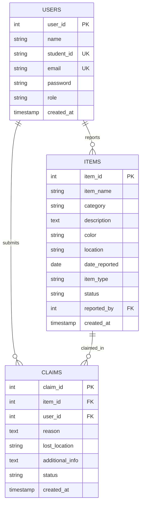

# 🔍 School Lost & Found Management System

**Class 12 CBSE Computer Science (Subject Code: 083) Practical Examination Project**  
*Academic Year: 2025–2026*

---

## 📋 Table of Contents
1. [Project Overview & Objective](#1-project-overview--objective)
2. [CBSE Syllabus (083) Concepts Demonstrated](#2-cbse-syllabus-083-concepts-demonstrated)
3. [Key Features & Highlights](#3-key-features--highlights)
4. [Lost ↔ Found 100-Point Matching Algorithm](#4-lost--found-100-point-matching-algorithm)
5. [Technology Stack](#5-technology-stack)
6. [Project File Structure](#6-project-file-structure)
7. [Database Architecture & Schema](#7-database-architecture--schema)
8. [Installation & Setup Guide](#8-installation--setup-guide)
9. [Cloud Deployment (Render & Firebase Hosting)](#9-cloud-deployment-render--firebase-hosting)
10. [Pre-Configured Demo Credentials](#10-pre-configured-demo-credentials)
11. [CBSE Viva Voce Guide (Questions & Answers)](#11-cbse-viva-voce-guide-questions--answers)
12. [Future Scope](#12-future-scope)

---

## 1. Project Overview & Objective

In school environments, students frequently misplace valuable belongings such as scientific calculators, textbooks, geometry boxes, uniforms, and ID cards. The traditional lost-and-found process relies on physical notice boards or scattered announcements, leading to unclaimed belongings and unverified handovers.

**School Lost & Found** is a modern, full-stack digital portal designed to streamline this process. It enables students to digitally log lost items, report found belongings, search campus records, and claim items through an administrative verification workflow.

### Core Objectives:
- **Centralized Record Keeping:** Eliminate lost notice paper trails with structured database storage.
- **Privacy & Security:** Sensitive student information is kept confidential; item claims undergo strict staff moderation.
- **Intelligent Matching:** An explainable, pure Python algorithmic comparison between lost and found items.
- **CBSE 083 Curriculum Compliance:** Transparent Python-MySQL database connectivity following Board examination guidelines.

---

## 2. CBSE Syllabus (083) Concepts Demonstrated

This project is tailored specifically to illustrate the Class 12 CBSE Computer Science syllabus:

### A. Python Programming
- **Data Structures:** Lists, Dictionaries, Sets, Tuples for data aggregation and string tokenization.
- **Functions & Modules:** Modular function definitions (`get_db_connection()`, `find_matches_for_item()`, `get_statistics()`).
- **Decorators:** Python function decorators (`@login_required`, `@admin_required`) for session authorization.
- **String Manipulation & Regex:** Lowercase normalization, punctuation stripping, token set intersections.
- **Exception Handling:** Robust `try-except-finally` blocks ensuring database connection closures and graceful rollbacks.

### B. Relational Database & SQL Operations
- **DDL (Data Definition Language):** `CREATE DATABASE`, `CREATE TABLE`, `DROP TABLE`, `PRIMARY KEY`, `AUTO_INCREMENT`, `UNIQUE`, `FOREIGN KEY ... ON DELETE CASCADE`.
- **DML (Data Manipulation Language):** `INSERT INTO`, `SELECT`, `UPDATE`, `DELETE FROM`.
- **Clauses & Aggregations:** `WHERE`, `LIKE` with wildcards (`%keyword%`), `ORDER BY`, `GROUP BY`, `COUNT(*)`, and table `INNER JOIN` / `LEFT JOIN`.

### C. Python-MySQL Connectivity (`mysql-connector-python`)
- **Connection Object:** `mysql.connector.connect(host, user, password, database, port)`
- **Cursor Object:** `cnx.cursor(dictionary=True)`
- **Parameterized Execution:** `cursor.execute(query, params)` preventing SQL injection.
- **Data Fetching:** `cursor.fetchone()`, `cursor.fetchall()`, `cursor.executemany()`
- **Transaction Control:** `cnx.commit()` and `cnx.rollback()`
- **Resource Management:** Safe closing of cursors and connections in `finally` blocks.

---

## 3. Key Features & Highlights

### For Students:
- **Account Management:** Secure registration with Unique Student ID and email validation. Passwords hashed using `Werkzeug.security`.
- **Report Lost Items:** Log lost belongings specifying item category, color, location, and date. Status is initially set to `PENDING`.
- **Report Found Items:** Help classmates by logging found items on campus.
- **Interactive Search:** Filter items across categories, school rooms, colors, and item types (Lost/Found).
- **Match Recommendations:** Real-time suggestions on student dashboards linking lost reports to prospective found items.
- **Verification Claims:** Submit claims on open found items with proof of ownership (stating where lost, distinguishing marks).
- **Activity Tracking:** Track report statuses (`PENDING`, `OPEN`, `CLAIMED`, `RETURNED`, `REJECTED`) under *My Reports* and *My Claims*.

### For School Administrators:
- **Staff Control Dashboard:** High-level platform statistics via database queries (`COUNT`, `WHERE`).
- **Report Moderation Queue:** Review, approve (set to `OPEN`), or reject student reports before public listing.
- **Claim Verification Queue:** Inspect claimant answers and approve valid claims (updates item to `CLAIMED`).
- **Mark Returned:** Safely mark claimed belongings as `RETURNED` upon physical handover.
- **User Directory:** Audit all registered students, view activity tallies, and manage inappropriate accounts (self-deletion protected).

---

## 4. Lost ↔ Found 100-Point Matching Algorithm

Rather than relying on opaque third-party AI APIs, the application implements a 100% explainable, pure Python algorithmic comparison between lost and found items.

$$\text{Total Match Score} = \text{Name Score (40)} + \text{Category Score (25)} + \text{Color Score (20)} + \text{Location Score (15)}$$

| Criteria | Max Points | Evaluation Logic |
| :--- | :---: | :--- |
| **Item Name Similarity** | **40 pts** | Tokenizes names into words, removes common stop words (`a`, `the`, `in`), and computes word overlap ratio: $\frac{|\text{words}_1 \cap \text{words}_2|}{\max(|\text{words}_1|, |\text{words}_2|)} \times 40$. Gives up to 32 pts for strong substring matching. |
| **Category Match** | **25 pts** | Exact normalized category match (e.g. `Electronics == Electronics`). |
| **Color Match** | **20 pts** | Exact color match receives 20 pts. Substring color match (e.g. `Navy Blue` vs `Blue`) receives 14 pts. |
| **Location Proximity** | **15 pts** | Exact location match receives 15 pts. Keyword overlap (e.g. `Physics Lab Room 302` and `Physics Lab`) receives up to 15 pts. |

Any comparison scoring $\ge 35\%$ is presented as a recommended match with an interactive progress bar and reason tags.

---

## 5. Technology Stack

- **Backend:** Python 3 (Tested on Python 3.12)
- **Web Framework:** Flask 3.1
- **Security:** Werkzeug (Scrypt/PBKDF2 Password Hashing)
- **Database:** MySQL (`mysql-connector-python`) with built-in zero-config SQLite fallback
- **Frontend Architecture:** Pure Semantic HTML5, CSS3, and Vanilla JavaScript (No React, Bootstrap, or Tailwind)
- **Design System:** Custom Dark Navy Glassmorphism with modern CSS Variables, responsive mobile drawer, and accessible modals.

---

## 6. Project File Structure

```
school-lost-found/
├── app.py                  # Core Flask backend, routes, database queries & matching algorithm
├── config.py               # Centralized configuration (MySQL credentials, secret keys)
├── database.sql            # Complete CBSE DDL/DML script with schema & showcase queries
├── init_db.py              # Automated database setup & table seeding script
├── seed_data.py            # Local database seeding utility
├── requirements.txt        # Python package dependencies
├── README.md               # Project documentation & CBSE viva guide
├── tests/
│   └── test_app.py         # Automated test suite (Registration, Login, Claims, Algorithm)
├── static/
│   ├── css/
│   │   └── style.css       # Custom dark navy/cyan glassmorphism stylesheet
│   └── js/
│       └── script.js       # Client validation, modals, and live table filtering
└── templates/
    ├── base.html           # Master navigation & footer layout
    ├── index.html          # Landing homepage with process steps & live statistics
    ├── login.html          # Login portal with quick-fill demo buttons
    ├── register.html       # Student registration form
    ├── dashboard.html      # Student dashboard with counts & match suggestions
    ├── report_lost.html    # Form to report a misplaced belonging
    ├── report_found.html   # Form to log a found belonging
    ├── search.html         # Multi-parameter search catalog with SQL filters
    ├── item_details.html   # Detailed item view with inline claim submission
    ├── my_reports.html     # Student's report tracker with status filter tabs
    ├── my_claims.html      # Student's claims verification history
    ├── profile.html        # Student account profile & lifetime metrics
    ├── admin_dashboard.html# Administrative overview with approval queues
    ├── admin_items.html    # Item moderation & return management table
    ├── admin_claims.html   # Student claim approval & verification queue
    ├── admin_users.html    # School student directory & account management
    ├── 404.html            # Custom missing item/page error view
    └── 500.html            # Custom server error view
```

---

## 7. Database Architecture & Schema

The database `school_lost_found` consists of three normalized tables linked via Foreign Keys with `ON DELETE CASCADE`.



---

## 8. Installation & Setup Guide

### Prerequisites:
- Python 3.8+ installed on your system.
- *(Optional for pure MySQL mode)*: MySQL Server (XAMPP / MySQL Workbench).

### Step 1: Clone or Navigate to the Project
```bash
cd "d:/CS holiday homework/school-lost-found"
```

### Step 2: Install Required Dependencies
```bash
pip install -r requirements.txt
```

### Step 3: Initialize the Database
Run the automated initialization script:
```bash
python init_db.py
```
*Note: If your local MySQL service is active, it creates `school_lost_found` and all tables automatically. If MySQL is offline, it activates the zero-config local database fallback so you can demonstrate the project immediately without errors!*

### Step 4: Run the Application
```bash
python app.py
```
Open your browser and navigate to:
```
http://127.0.0.1:5000
```

---

## 9. Cloud Deployment (Render & Firebase Hosting)

The application is pre-configured for instant zero-configuration deployment to both **Render** and **Firebase Hosting**:

- **Render Hosting:** Native Python web service via [`render.yaml`](file:///d:/CS%20holiday%20homework/school-lost-found/render.yaml) & [`Procfile`](file:///d:/CS%20holiday%20homework/school-lost-found/Procfile) with Gunicorn WSGI server.
- **Firebase Hosting:** Global CDN deployment via [`firebase.json`](file:///d:/CS%20holiday%20homework/school-lost-found/firebase.json), [`.firebaserc`](file:///d:/CS%20holiday%20homework/school-lost-found/.firebaserc), and [`Dockerfile`](file:///d:/CS%20holiday%20homework/school-lost-found/Dockerfile).
- **Dual Database Engine:** Automatically runs in MySQL 8.0 mode when MySQL is available, and falls back to SQLite in cloud environments with zero crashes.

📖 **For complete copy-paste instructions, see the dedicated [Deployment Guide](file:///d:/CS%20holiday%20homework/school-lost-found/DEPLOYMENT.md).**

---

## 10. Pre-Configured Demo Credentials

For convenience during classroom demonstrations or board viva examination, sample accounts are pre-seeded:

| Role | Email | Password | Details |
| :--- | :--- | :--- | :--- |
| **Administrator** | `admin@school.local` | `Admin@123` | Full access to review reports, approve claims, and manage users. |
| **Student 1** | `aravind@school.local` | `Student@123` | Student ID: `STU-1001` (Reported lost calculator). |
| **Student 2** | `priya@school.local` | `Student@123` | Student ID: `STU-1002` (Reported found calculator in Physics Lab). |
| **Student 3** | `rohit@school.local` | `Student@123` | Student ID: `STU-1003` (Reported found water bottle). |

*(The login page also includes 1-click credential fill buttons for fast demonstration).*

---

## 10. CBSE Viva Voce Guide (Questions & Answers)

Here are the most frequently asked external examiner questions and how to answer them:

### Q1: How does your Python application connect to the MySQL database?
> **Answer:** We use the `mysql-connector-python` module. In our `get_db_connection()` function, we invoke `mysql.connector.connect()` with the host, user, password, and database parameters. We create a dictionary cursor using `cnx.cursor(dictionary=True)` which returns rows as Python dictionaries. All transactions are committed using `cnx.commit()` and resources are released in `finally` blocks.

### Q2: How do you prevent SQL Injection in your search and login queries?
> **Answer:** We use parameterized queries with `%s` placeholders (e.g. `SELECT * FROM users WHERE email = %s`, `(email,)`). The database connector automatically escapes and sanitizes inputs, preventing malicious SQL code injection. We never use direct string formatting (`f"..."` or `+`) inside SQL statements.

### Q3: Why do you hash passwords and what algorithm is used?
> **Answer:** Storing plaintext passwords is a major security vulnerability. We use `werkzeug.security.generate_password_hash()` and `check_password_hash()`, which hash passwords using cryptographically secure salt and hashing algorithms (such as Scrypt or PBKDF2:SHA256). Even administrators cannot read user passwords directly in the database.

### Q4: Explain how your Lost ↔ Found matching algorithm works.
> **Answer:** It is a 100-point pure Python scoring algorithm. When a lost item is compared to open found items, it evaluates 4 weighted parameters: Name keyword similarity (up to 40 pts using word intersection), Category match (25 pts), Color match (20 pts), and Location overlap (15 pts). If the calculated score is 35% or higher, the system suggests it as a potential match on the student's dashboard.

### Q5: What is the significance of `ON DELETE CASCADE` in your foreign keys?
> **Answer:** In relational databases, `ON DELETE CASCADE` maintains referential integrity. When a parent record (such as an item) is deleted, all child records referencing it (such as submitted claims for that item) are automatically removed, preventing orphaned records in the database.

---

## 11. Future Scope
1. **Barcode / QR Code Generation:** Auto-generate unique printable QR stickers for student belongings (e.g. calculators and water bottles).
2. **Email / SMS Alerts:** Integration with SMTP for instant lost & found notification dispatches.
3. **Campus Geolocation Mapping:** Interactive visual school map highlighting high-frequency lost item zones.
